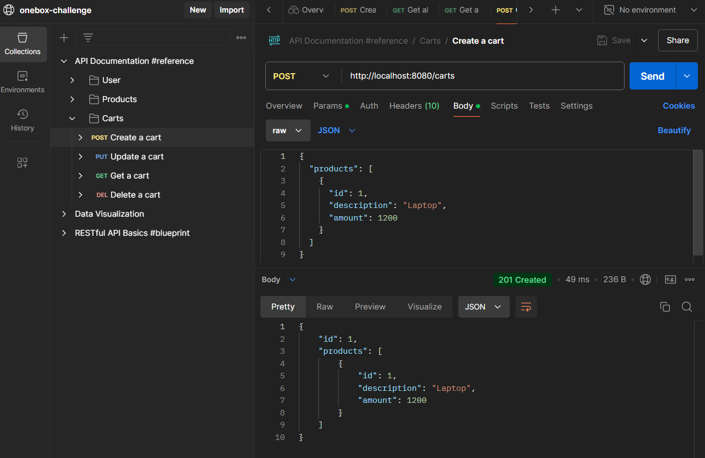

# OneBox Software Engineer Test

## Table of Contents
1. [Abstract](#abstract)
2. [Technologies Used](#technologies-used)
3. [Approach to the Solution](#approach-to-the-solution)
4. [Pending Topics](#pending-topics)
5. [Possible Improvements](#possible-improvements)
6. [How to Run the Application](#how-to-run-the-application)
7. [How to Test the Application](#how-to-test-the-application)

## Abstract
This project is a solution to the OneBox Software Engineer technical test. 
It involves simulating the functionality of an e-commerce system.
To achieve this we implement a RESTful API using clean architecture principles to manage `Product` and `Cart` entities. 
The API supports CRUD operations for both entities while adhering to industry standards and best practices, such as `API-first development`, validation, robust error handling and testing.

## Technologies Used
- **Programming Language:** Java 21
- **Frameworks:** Spring Boot 3.4.0 (Spring Web, Spring Data JPA, Hibernate)
- **Database:** H2 (In-memory database)
- **Build Tool:** Maven
- **API Specification:** OpenAPI (openapi-generator-maven-plugin)
- **Validation:** Hibernate Validator (Jakarta Validation API)
- **Testing:** JUnit 5, MockMvc
- **Postman:** A workspace is created (for demo and manual testing) 
- **Other Tools:** Lombok, Git, Docker (optional for deployment)

## Approach to the Solution
1. **API-First Design:**
    - Defined endpoints and data models using OpenAPI specifications.
    - Autogenerated DTOs and interfaces using `openapi-generator-maven-plugin`.

2. **Hexagonal Architecture:**
    - Divided the project into `application`, `domain`, and `infrastructure` layers for better maintainability and separation of concerns.
    - Used ports and adapters to decouple business logic from infrastructure.

3. **Entity Relationships:**
    - Implemented a `Product` entity, representing individual items in the catalog.
    - Designed a `Cart` entity with a `ManyToMany` relationship with `Product`, allowing multiple products to belong to multiple carts.

4. **Validation and Error Handling:**
    - Applied constraints at the DTO level for data validation.
    - Used a `GlobalExceptionHandler` for consistent error responses.

5. **Testing:**
    - Developed integration tests for all endpoints using MockMvc.
    - Verified data persistence with H2 and tested invalid scenarios to ensure robust error handling.

6. **Incremental Development:**
    - Followed an iterative approach by first implementing `Api`, then `Product` functionality and last extending it to `Cart`.

## Pending Topics
1. **Deployment:**
    - Currently, the application runs locally with an in-memory database. Docker configurations could be added for deployment in production-like environments.

2. **Security:**
    - Authentication and authorization mechanisms (e.g., JWT) are not implemented.

3. **Caching:**
   - Introduce in-memory caching (e.g., Caffeine) for frequently accessed data like product details.

4. **API Documentation:**
    - UI integration for interactive API documentation (e.g.: Swagger UI, Stoplight, Redocly).

5. **OpenAPI Refactor:**
   - Refactor `e-commerce.yaml` extracting and reusing schemas, responses, requests and errors.


## Possible Improvements
1. **Scalability:**
    - Containerize the application using Docker and orchestrate with Kubernetes for scalability.

2. **Testing Enhancements:**
    - Include contract tests to validate API compatibility with consumers.
    - Expand unit tests to cover edge cases more comprehensively.
    - Add integration tests to improve bad path coverage.

3. **Monitoring:**
    - Integrate tools like Prometheus and Grafana for performance monitoring and alerting.

4. **API Versioning:**
    - Introduce versioning to maintain backward compatibility.

5. **API Decouple:**
    - Extract OpenApi generation and data into a spec repository.

6. **Data Persistence:**
    - Transition from H2 to a production-grade database (e.g.: PostgreSQL or MySQL).

## How to Run the Application
1. **Clone the Repository:**
2. **Build the Project:**
3. **Run the Application:**
4. **Access the API:**

## How to Test the Application
- This Postman workspace can be used:
```
https://www.postman.com/material-operator-40700101/workspace/onebox-challenge/folder/19719512-c8a8df6c-2fe2-43de-8a1f-b83cd3f50645?action=share&source=copy-link&creator=19719512
```


